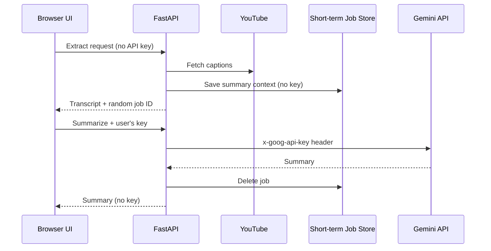

# YouTube Transcript

YouTube Transcript is a browser app and CLI that turn original-language YouTube captions into reusable Markdown, text, JSON, SRT, or VTT files. Gemini summarization uses a key supplied by the person making the request; the hosted service does not have an operator API key.

## Features

- Extract manual or auto-generated original-language captions from a YouTube URL or 11-character video ID
- Include timestamps in every format and source chapters in Markdown, text, and JSON
- Create a Gemini summary in the transcript language, a common language, or another BCP 47 language
- Ask before sending captions longer than 50,000 characters: use a complete-segment prefix, send all captions, or skip the summary
- Load Gemini models that advertise `generateContent` support
- Preview, copy, and download transcript and summary files in the browser
- Run the same browser UI locally or as a hosted FastAPI service
- Use local browser cookies for restricted videos only when the server runs on the same computer
- Keep the CLI for scripts and batch-friendly file output

## Requirements

- Python 3.11–3.13
- [uv](https://docs.astral.sh/uv/)
- A personal Gemini API key for summarization and model discovery; caption extraction works without one

```bash
git clone https://github.com/kkensuke/yt_transcript.git
cd yt_transcript
```

## Browser app

### Run locally

```bash
./scripts/run-app.sh
```

The launcher installs the optional Web dependencies, starts FastAPI on `127.0.0.1:8000`, and opens the system browser. It runs the current files directly from `src/`, so UI edits are not hidden by a stale installed copy.

The Web UI does not override browser zoom shortcuts. Use the browser's standard zoom controls when a different scale is needed.

Verify the local source and routes without starting the server:

```bash
./scripts/run-app.sh --check
```

In Settings, enter your own Gemini API key when creating a summary or loading available models. The browser sends it only for that Gemini operation. It is not part of the transcript extraction request, is not placed in a URL, and is not saved by the app. The summary flow clears the input after sending it; Clear, reload, and tab close also clear it.

Local mode can offer **Browser cookies** because Python and the selected browser are on the same computer. Try without cookies first.

### Recommended architecture



The two API calls deliberately separate caption extraction from credential handling:

1. `POST /api/extract` accepts the video and transcript options, but its schema rejects API-key fields.
2. If a summary is requested, the server stores only the extracted summary context in bounded process memory and returns a cryptographically random job ID.
3. `POST /api/summarize` accepts that ID and the user's key in `X-Gemini-Api-Key`.
4. The server forwards the key to Google in `X-Goog-Api-Key`, never in the request URL.
5. A completed or skipped job is deleted immediately. A failed summary can be retried until its short TTL expires.

The default job TTL is 10 minutes. Jobs are also bounded by count and total pending caption characters. They do not contain Gemini credentials.

### API surface

| Method | Path | Purpose | Gemini key |
|---|---|---|---|
| `GET` | `/` | Browser UI | None |
| `GET` | `/healthz` | Process health | None |
| `GET` | `/api/info` | Version, language choices, and local/hosted capabilities | None |
| `POST` | `/api/extract` | Fetch and format captions; optionally create a summary job | Rejected from the body |
| `POST` | `/api/summarize` | Summarize, retry, or skip a pending job | `X-Gemini-Api-Key`, except for skip |
| `POST` | `/api/gemini/models` | Load models available to the user's key | `X-Gemini-Api-Key` |
| `POST` | `/api/summary/discard` | Delete an unused pending job | None |

All API responses use `Cache-Control: no-store`. Validation responses omit submitted values, so an accidentally supplied secret is not reflected to the browser.

## Hosted deployment

Install the Web dependencies and set hosted-mode allowlists:

```bash
uv sync --extra web

export YT_TRANSCRIPT_MODE=hosted
export YT_TRANSCRIPT_ALLOWED_HOSTS="transcript.example.com"
export YT_TRANSCRIPT_ALLOWED_ORIGINS="https://transcript.example.com"

uv run --extra web uvicorn yt_transcript.web:app \
  --host 0.0.0.0 \
  --port "${PORT:-8000}" \
  --workers 1
```

Do not set `GEMINI_API_KEY` for the Web service. The Web path intentionally ignores both `GEMINI_API_KEY` and `GEMINI_MODEL`; users supply their key in the UI, and the built-in model is the initial selection. Those environment variables remain CLI-only.

`./scripts/run-app.sh` starts that same BYOK Web path, so it also ignores `GEMINI_API_KEY`. This keeps local testing behavior aligned with the public service. `API_KEY` is not a recognized variable. Use the CLI when environment-based `GEMINI_API_KEY` loading is desired.

Use exactly one worker with the current in-memory Short-term Job Store. Multiple workers or replicas can route the summarize request away from the process that created its job. Scaling out requires a shared TTL store or verified session affinity while continuing to exclude credentials from stored job data.

Hosted mode hides and rejects `cookies-from-browser`, because a remote server cannot read a visitor's local browser profile.

### Web environment variables

| Variable | Default | Purpose |
|---|---:|---|
| `YT_TRANSCRIPT_MODE` | `local` | `local` or `hosted` capability and configuration mode |
| `YT_TRANSCRIPT_ALLOWED_HOSTS` | Local hosts | Comma-separated Host allowlist; required in hosted mode |
| `YT_TRANSCRIPT_ALLOWED_ORIGINS` | Derived locally | Comma-separated Origin allowlist for state-changing API calls |
| `YT_TRANSCRIPT_HOST` | Mode-dependent | Host used by `yt-transcript-web` and `run-app.sh` |
| `PORT` | `8000` | Listening port and local allowed-origin port |
| `YT_TRANSCRIPT_OPEN_BROWSER` | `1` locally | Set to `0` to suppress automatic browser opening |
| `YT_TRANSCRIPT_JOB_TTL` | `600` | Pending summary lifetime in seconds |
| `YT_TRANSCRIPT_MAX_JOBS` | `64` | Maximum pending summary jobs per process |
| `YT_TRANSCRIPT_MAX_PENDING_CHARACTERS` | `5000000` | Total pending caption characters per process |
| `YT_TRANSCRIPT_MAX_WORKERS` | `4` | Maximum concurrent blocking extraction/Gemini operations |

### Public-service security notes

- Terminate TLS before the app. The backend necessarily receives each user's key transiently so it can proxy the Gemini request.
- Configure the hosting proxy not to log request headers. The application does not intentionally log headers or credentials.
- Put request-rate limits and abuse controls at the edge. The in-process semaphore and bounded job store limit concurrency and memory, but are not a per-user quota system.
- Keep the Host and Origin allowlists exact. Do not use wildcard hosts for a public deployment.
- The app sends browser requests without cookies, sets a restrictive Content Security Policy, caps request bodies at 64 KiB, and returns generic unexpected-error responses.
- API keys can still be visible to the user in their own browser developer tools or to a compromised browser extension. Users should apply appropriate Gemini quota and key restrictions.

## CLI

The CLI continues to read `GEMINI_API_KEY` and optional `GEMINI_MODEL` from its launch environment. The API key cannot be passed as a command-line argument, avoiding accidental shell-history exposure.

```bash
# Transcript and summary
export GEMINI_API_KEY="YOUR_GEMINI_API_KEY"
uv run yt-transcript "https://www.youtube.com/watch?v=VIDEO_ID"

# Transcript only
uv run yt-transcript "VIDEO_ID" --no-summary

# WebVTT transcript
uv run yt-transcript "VIDEO_ID" --format vtt --no-summary

# Send all captions when the source exceeds 50,000 characters
uv run yt-transcript "VIDEO_ID" --long-summary full

# Use local Chrome cookies for a restricted video
uv run yt-transcript "VIDEO_ID" --cookies-from-browser chrome

# Select a model and summary language
uv run yt-transcript "VIDEO_ID" \
  --gemini-model "gemini-flash-latest" \
  --summary-lang fr

# List models available to the environment key
uv run yt-transcript --list-gemini-models

# Write results to another directory
uv run yt-transcript "VIDEO_ID" --output-dir output/
```

### CLI options

| Option | Description |
|---|---|
| `url` | YouTube URL or 11-character video ID; omitted with `--list-gemini-models` |
| `--output-dir DIR` | Directory for transcript and summary files |
| `--format {md,txt,json,srt,vtt}` | Transcript format; defaults to `md` |
| `--no-summary` | Skip Gemini summarization |
| `--summary-lang LANGUAGE` | `auto` or a BCP 47 tag such as `en`, `ja`, `zh-Hans`, `pt-BR`, or `it` |
| `--long-summary {skip,truncate,full}` | Behavior above 50,000 caption characters; defaults to `skip` |
| `--cookies-from-browser BROWSER` | Use local `chrome`, `chromium`, `edge`, `firefox`, `safari`, or `brave` cookies |
| `--gemini-model MODEL_ID` | Gemini model ID for summarization |
| `--list-gemini-models` | List models supporting `generateContent`, then exit |

The CLI's model order is `--gemini-model`, then `GEMINI_MODEL`, then the built-in `gemini-flash-lite-latest`. If its key is missing or summarization fails, the transcript is still written and a warning is shown.

## Captions, summary languages, and downloads

Caption cues such as `[音楽]`, `[拍手]`, and `♪` are preserved. Whitespace normalization removes unwanted spacing without deleting cue text. Markdown timestamps link to the corresponding YouTube position.

**Same as transcript** asks Gemini to use the captions' primary language. Common choices include English, Japanese, Simplified and Traditional Chinese, Korean, Spanish, French, German, Brazilian Portuguese, and Hindi. **Other…** accepts another valid BCP 47 tag such as `it`, `ar`, or `uk`.

The browser UI creates downloads with `Blob` URLs; it does not upload completed artifacts back to a file-saving endpoint.

## Development and verification

```bash
uv sync --extra web --extra dev
uv run --extra web --extra dev pytest
uv run --extra web --extra dev ruff check .
node --check src/yt_transcript/ui/app.js
node --check src/yt_transcript/ui/enhancements.js
./scripts/run-app.sh --check
```

Automated tests mock YouTube and Gemini. Before a release, manually test a public captioned video because YouTube behavior can vary by region, rate limit, and upstream changes.

## Project layout

```text
src/yt_transcript/
├── web.py              # FastAPI UI and HTTP boundary
├── web_state.py        # Bounded, expiring summary jobs (no credentials)
├── cli.py              # CLI boundary and CLI-only environment lookup
├── service.py          # Shared extraction and summarization workflow
├── youtube.py          # YouTube metadata and caption ingestion
├── gemini.py           # Gemini HTTP client
├── renderers.py        # Transcript formats
└── ui/                 # Browser HTML, CSS, and JavaScript
```

Project naming follows ecosystem conventions:

- GitHub repository: `yt_transcript`
- Python distribution: `yt-transcript`
- Python package: `yt_transcript`
- CLI command: `yt-transcript`
- Browser server command: `yt-transcript-web`

## Troubleshooting

### No captions are found

- Confirm that the video has manual or auto-generated captions.
- Confirm that YouTube exposes an original-language caption track.
- Update `yt-dlp`: `uv lock --upgrade-package yt-dlp && uv sync`.

### `HTTP 429` appears

YouTube is temporarily rate-limiting requests. Wait and retry. Local users can try a signed-in browser profile; hosted mode cannot access it.

### Only Gemini summarization fails

- Re-enter the API key; it is cleared after each summary request.
- Check the selected model, quota, and key restrictions.
- Use **Load available models** with the same key.
- The transcript remains downloadable. A failed short-term job can be retried until it expires.

## License

This project is licensed under the [MIT License](LICENSE). Third-party dependencies retain their own licenses.
