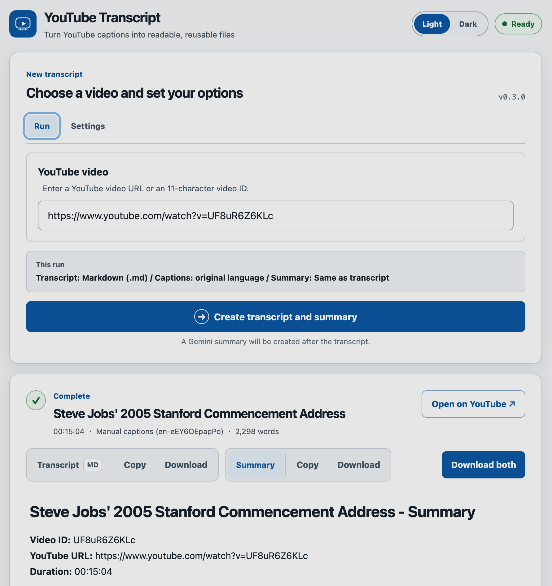

# YouTube Transcript

YouTube Transcript provides a browser app and CLI that turn original-language YouTube captions into reusable Markdown, text, JSON, SRT, or VTT files. Caption extraction works without an API key; Gemini summaries use a key supplied by the person making the request.

## Features

- Extract manual or auto-generated original-language captions from a YouTube URL or 11-character video ID
- Include timestamps in every format and source chapters in Markdown, text, and JSON
- Create a Gemini summary in the transcript language or another BCP 47 language
- Ask what to do before sending captions longer than 50,000 characters
- Preview, copy, and download transcript and summary files in the browser
- Use local browser cookies for restricted videos when running on the same computer
- Keep the CLI for scripts and batch-friendly file output

## Installation

### Homebrew

Homebrew installs the CLI and browser app together without requiring a separately managed Python environment:

```bash
brew install kkensuke/tap/yt-transcript
yt-transcript --version
```

A personal [Gemini API key](https://aistudio.google.com/api-keys) is optional and is used only for summaries and model discovery. Caption extraction does not require one.

### From source (Windows and other platforms)

Windows users without Homebrew can run the application from a source checkout. This method also works on macOS and Linux. Install Git and [uv](https://docs.astral.sh/uv/), then sync the CLI and browser-app dependencies locked by the project:

```bash
git clone https://github.com/kkensuke/yt_transcript.git
cd yt_transcript
uv sync --locked --extra web
uv run yt-transcript --version
```

The source installation lives in the repository's `.venv` rather than on the system command path. Stay in the checkout and prefix each later command with `uv run`:

| Action | Homebrew installation | From source |
|---|---|---|
| Show the version | `yt-transcript --version` | `uv run yt-transcript --version` |
| Start the browser app | `yt-transcript web` | `uv run yt-transcript web` |
| Run the CLI | `yt-transcript "YOUTUBE_URL" --no-summary` | `uv run yt-transcript "YOUTUBE_URL" --no-summary` |

In Windows PowerShell, environment variables use PowerShell syntax. For example:

```powershell
$env:GEMINI_API_KEY = "YOUR_GEMINI_API_KEY"
$env:GEMINI_MODEL = "gemini-flash-lite-latest" # Optional
uv run yt-transcript "YOUTUBE_URL"
```

## Browser app



Start the local browser app:

```bash
yt-transcript web
```

It starts the app on `127.0.0.1:8000` and opens the default browser. From a source checkout, run `uv run yt-transcript web` as described above.

Paste a YouTube URL or video ID, adjust the transcript and summary settings if needed, and run the extraction. Completed transcripts and summaries can be previewed, copied, or downloaded from the browser.

### Gemini API key behavior

The key is needed only for Gemini summaries and model discovery. The browser sends it to the app for that operation, and the app forwards it to Google without placing it in a URL or saving it. The summary flow clears the input after sending it; clearing, reloading, or closing the tab also removes it.

When the app runs locally, it can use `GEMINI_API_KEY` as a fallback and `GEMINI_MODEL` as the initial model. The key remains in the server process and is never returned to the browser; a key entered in the UI overrides it for that request.

```bash
export GEMINI_API_KEY="YOUR_GEMINI_API_KEY"
export GEMINI_MODEL="gemini-flash-lite-latest"  # Optional
yt-transcript web
```

The fallback is available only to loopback requests in local mode. Hosted mode always ignores both variables and requires each user to enter a key. `API_KEY` is not a recognized variable.

Local mode can use cookies from a supported browser profile for videos that require sign-in. Try without cookies first. A hosted instance cannot access a visitor's browser profile.

For self-hosting, see [Hosted deployment](docs/deployment.md).

## CLI

The CLI reads `GEMINI_API_KEY` and optional `GEMINI_MODEL` from its environment. The API key cannot be passed as a command-line argument.

```bash
# Transcript and summary
export GEMINI_API_KEY="YOUR_GEMINI_API_KEY"
yt-transcript "YOUTUBE_URL"
# or yt-transcript "VIDEO_ID"

# Show help
yt-transcript --help

# Transcript only
yt-transcript "YOUTUBE_URL" --no-summary

# Write results to another directory
yt-transcript "YOUTUBE_URL" --output-dir output/

# Write results in JSON format without a summary
yt-transcript "YOUTUBE_URL" --format json --no-summary

# Use local Chrome cookies for a restricted video
yt-transcript "YOUTUBE_URL" --cookies-from-browser chrome

# Select a model and summary language
yt-transcript "YOUTUBE_URL" \
  --gemini-model "gemini-flash-latest" \
  --summary-lang ja

# List models available to the environment key
yt-transcript --list-gemini-models

# Short aliases can be combined for compact commands
yt-transcript "YOUTUBE_URL" -o output/
yt-transcript "YOUTUBE_URL" -f json -n
yt-transcript "YOUTUBE_URL" -c chrome
yt-transcript "YOUTUBE_URL" -m "gemini-flash-latest" -l ja
```

When running these examples from a source checkout, add the `uv run` prefix shown in the installation table.

### CLI options

| Option                                    | Description                                                                      |
| ----------------------------------------- | -------------------------------------------------------------------------------- |
| `url`                                     | YouTube URL or 11-character video ID; omitted with `-M` / `--list-gemini-models` |
| `-o, --output-dir DIR`                    | Directory for transcript and summary files                                       |
| `-f, --format {md,txt,json,srt,vtt}`      | Transcript format; defaults to `md`                                              |
| `-n, --no-summary`                        | Skip Gemini summarization                                                        |
| `-l, --summary-lang LANGUAGE`             | `auto` or a BCP 47 tag such as `en`, `ja`, `zh-Hans`, `pt-BR`, or `it`           |
| `-L, --long-summary {skip,truncate,full}` | Above 50,000 characters, skip, summarize a prefix, or send the full transcript   |
| `-c, --cookies-from-browser BROWSER`      | Use local `chrome`, `chromium`, `edge`, `firefox`, `safari`, or `brave` cookies  |
| `-m, --gemini-model MODEL_ID`             | Select the Gemini model                                                          |
| `-M, --list-gemini-models`                | List models supporting `generateContent`                                         |
| `-V, --version`                           | Print the installed application version                                          |
| `-h, --help`                              | Show CLI help                                                                    |


Long option names must be written in full; prefix abbreviations such as `--out` are not accepted. Use the short aliases above when a compact command is preferred.

The CLI selects the model in this order: `--gemini-model`, `GEMINI_MODEL`, then the built-in `gemini-flash-lite-latest`. If its key is missing or summarization fails, the transcript is still written and a warning is shown.

## Troubleshooting

### No captions are found

- Confirm that the video has manual or auto-generated captions.
- Confirm that YouTube exposes an original-language caption track.
- Homebrew users should run `brew update && brew upgrade yt-transcript`.
- Source users can update `yt-dlp` with `uv lock --upgrade-package yt-dlp && uv sync`.

### `HTTP 429` appears

YouTube is temporarily rate-limiting requests. Wait and retry. Local users can try a signed-in browser profile; hosted mode cannot access it.

### Only Gemini summarization fails

- Re-enter the API key; it is cleared after each summary request.
- Check the selected model, quota, and key restrictions.
- Use **Load available models** with the same key.
- The transcript remains downloadable. A failed short-term job can be retried until it expires.

## Further documentation

- [Architecture](docs/architecture.md) — request flow, internal HTTP boundary, and short-term job store
- [Hosted deployment](docs/deployment.md) — server setup, environment variables, and process model
- [Homebrew releases](docs/homebrew.md) — Tap architecture, one-time setup, and release process
- [Security](SECURITY.md) — credential handling, deployment checklist, and vulnerability reporting
- [Contributing](CONTRIBUTING.md) — development setup, verification, and project structure

## License

This project is licensed under the [MIT License](LICENSE). Third-party dependencies retain their own licenses.
