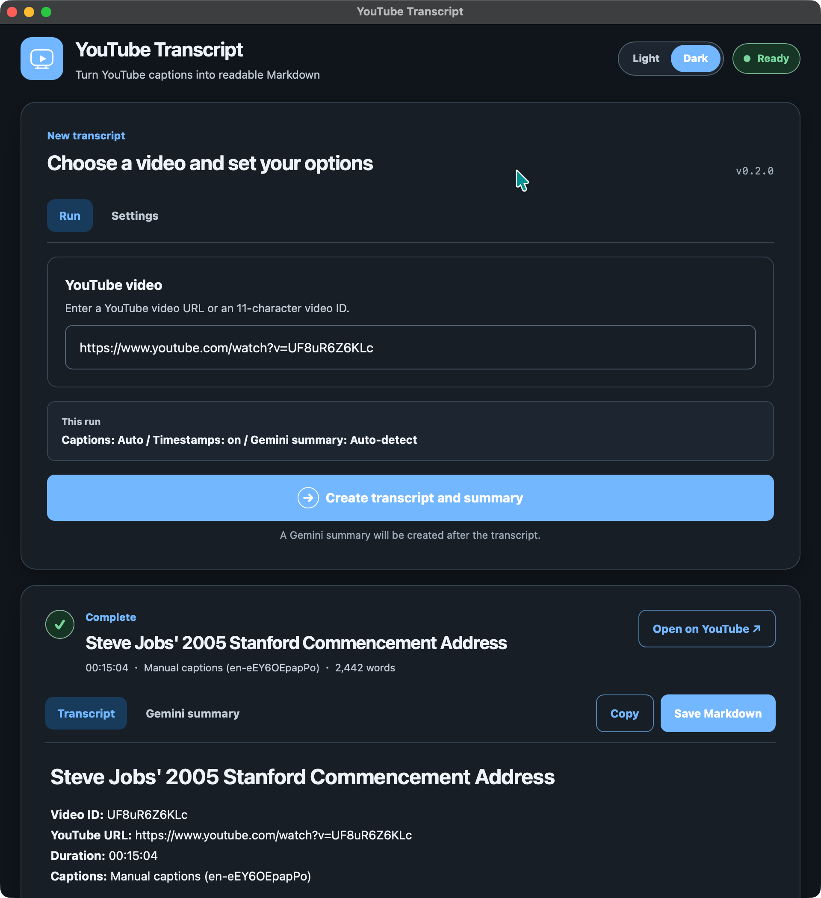

# YouTube Transcript

YouTube Transcript is a command-line tool and macOS desktop app that turns YouTube captions into readable Markdown, with optional Gemini summarization.

## Features

- Extract manual or auto-generated captions from a YouTube URL or 11-character video ID
- Prefer Japanese or English captions, or select a language automatically
- Create Markdown with or without timestamps
- Summarize in Japanese, English, or an automatically detected language with Gemini
- Load the currently available Gemini `generateContent` models in the desktop UI
- Select a Gemini Model ID from the CLI or desktop UI
- Save transcript and summary files together with `--output-dir`
- Use browser cookies for unlisted or age-restricted videos
- Preview, copy, and save results from the desktop app
- Switch between Light and Dark in the app

## Requirements

- CLI or source-based desktop app: Python 3.11–3.13 and [uv](https://docs.astral.sh/uv/)
- Building the macOS app: macOS 11 or later
- Gemini summarization and model discovery: a Gemini API key; caption extraction works without one

```bash
git clone https://github.com/kkensuke/yt_transcript.git
cd yt_transcript
```

## CLI

A CLI-only environment does not install `pywebview`.

```bash
# Transcript and Gemini summary when GEMINI_API_KEY is available
export GEMINI_API_KEY="YOUR_GEMINI_API_KEY"
uv run yt-transcript "https://www.youtube.com/watch?v=VIDEO_ID"

# Transcript only
uv run yt-transcript "VIDEO_ID" --no-summary

# Prefer Japanese captions and omit timestamps
uv run yt-transcript "VIDEO_ID" --caption-lang ja --no-timestamps

# Use Chrome cookies for a restricted video
uv run yt-transcript "VIDEO_ID" --cookies-from-browser chrome

# Select a Gemini Model ID from the CLI
uv run yt-transcript "VIDEO_ID" --gemini-model "gemini-flash-latest"

# Recommended when writing files to another directory
uv run yt-transcript "VIDEO_ID" --output-dir output/
```

### CLI options

| Option | Description |
|---|---|
| `url` | YouTube URL or 11-character video ID |
| `--output-dir DIR` | Directory for `<VIDEO_ID>_transcript.md` and `<VIDEO_ID>_summarized.md` |
| `--no-timestamps` | Omit paragraph timestamps |
| `--no-summary` | Skip Gemini summarization |
| `--summary-lang {auto,en,ja}` | Summary language |
| `--caption-lang {auto,en,ja}` | Preferred caption language |
| `--cookies-from-browser BROWSER` | Use cookies from `chrome`, `chromium`, `edge`, `firefox`, `safari`, or `brave` |
| `--gemini-model MODEL_ID` | Gemini Model ID for summarization |

With `--output-dir output/`, files are saved as `output/<VIDEO_ID>_transcript.md` and, when summarization succeeds, `output/<VIDEO_ID>_summarized.md`.

Run `uv run yt-transcript --help` to see the complete CLI help.

The CLI attempts summarization by default. If `GEMINI_API_KEY` is missing or summarization fails, the transcript is still saved and the reason is shown as a warning. A summary is saved next to the transcript as `<VIDEO_ID>_summarized.md`.

The Gemini Model ID is selected in this order:

1. `--gemini-model`
2. `GEMINI_MODEL`
3. The built-in default, `gemini-flash-lite-latest`

The API key cannot be passed as a command-line argument. Set `GEMINI_API_KEY` for CLI use so the key does not appear in the command history.

## Desktop app



### Run from source

```bash
./scripts/run-app.sh
```

The launcher syncs the `desktop` extra, starts the current code directly from `src/`, and opens it in a native desktop window.

Gemini summarization is enabled by default. Disable it in Settings to create only a transcript. To summarize, either enter an API key in Settings or define it before launching the app:

```bash
export GEMINI_API_KEY="YOUR_GEMINI_API_KEY"
export GEMINI_MODEL="gemini-flash-latest"  # Optional
./scripts/run-app.sh
```

Settings shows whether the API key and model came from the environment or the app default, but it never reveals the environment API key. A key or Model ID entered in the UI overrides the environment for that run only and is never saved.

### Available Gemini models

In Settings, select **Load available models** to query the Gemini Models API. The app lists only models that advertise support for `generateContent`. The current text field remains editable, so a Model ID can still be entered manually. If `GEMINI_API_KEY` is already configured, the app also attempts to load the list when the desktop bridge becomes ready.

### Appearance and zoom

When the app opens, it reads the current macOS appearance once and starts in the matching Light or Dark theme. While the app is open, use the **Light** and **Dark** controls in the header to switch manually. The manual choice is intentionally session-only: the next launch starts from the current macOS appearance again.

Use these keyboard shortcuts to change the UI scale:
- `Command` + `=`: zoom in
- `Command` + `-`: zoom out
- `Command` + `0`: reset to 100%

### Build the macOS `.app`

py2app cannot cross-compile, so build the app on macOS:

```bash
./scripts/build-macos-app.sh
open dist/YouTubeTranscript.app
```

The bundle is created at `dist/YouTubeTranscript.app`. It includes Python and its runtime dependencies, so users do not need to install Python or uv.

### Environment variables and the `.app`

When environment variables are set in a terminal and the app is opened from that same terminal, the app reads `GEMINI_API_KEY` and `GEMINI_MODEL`:

```bash
export GEMINI_API_KEY="YOUR_GEMINI_API_KEY"
export GEMINI_MODEL="gemini-flash-latest"  # Optional
open dist/YouTubeTranscript.app
```

When the `.app` is opened directly from Finder or Launchpad, shell environment variables are normally not inherited. Enter `GEMINI_API_KEY` in Settings each time you launch the app. The key is not saved and is discarded when the app quits.

After changing an environment variable, quit any running instance completely before opening the app again from the same terminal.

### Distribution

An unsigned app triggers a macOS Gatekeeper warning. General distribution requires signing with a Developer ID certificate from the Apple Developer Program and notarization by Apple. See Apple's [Notarizing macOS software before distribution](https://developer.apple.com/documentation/security/notarizing-macos-software-before-distribution).

## Project naming

The project uses the same base name consistently across GitHub, Python packaging, imports, and the CLI, using the separator conventional for each context:

- GitHub repository: `yt_transcript`
- Python distribution: `yt-transcript`
- Python package: `yt_transcript`
- CLI command: `yt-transcript`
- GUI entry point: `yt-transcript-app`
- macOS bundle: `YouTubeTranscript.app`

## Captions and browser cookies

Try caption extraction without cookies first. Use `--cookies-from-browser` in the CLI or Advanced caption settings in the desktop app only when a video requires a signed-in session, such as an age-restricted or unlisted video.

## Development and verification

```bash
uv sync --extra dev
uv run --extra dev pytest
uv run --extra dev ruff check .
./scripts/run-app.sh --check
```

Automated tests do not contact YouTube. Results can vary with YouTube changes, region, rate limits, and login state, so test a public video with captions manually before release.

## Troubleshooting

### No captions are found

- Confirm that the video has manual or auto-generated captions
- Set the caption language to `auto`
- Update `yt-dlp`: `uv lock --upgrade-package yt-dlp && uv sync`

### `HTTP 429` appears

YouTube is temporarily rate-limiting caption requests. Wait and try again. If the problem persists, select cookies from a signed-in browser.

### Only Gemini summarization fails

- Check the API key, Model ID, and quota
- Use **Load available models** to confirm that the selected model is currently advertised for `generateContent`
- The transcript remains available to save or copy; review the warning and try summarization again

### The `.app` does not launch

Run the executable from a terminal to view its log:

```bash
./dist/YouTubeTranscript.app/Contents/MacOS/YouTubeTranscript
```

## Technical references

- [pywebview JavaScript–Python bridge](https://pywebview.flowrl.com/guide/interdomain.html)
- [pywebview freezing](https://pywebview.flowrl.com/guide/freezing.html)
- [py2app tutorial](https://py2app.readthedocs.io/en/latest/tutorial.html)
- [Gemini models API](https://ai.google.dev/api/models)

## License

This project is licensed under the [MIT License](LICENSE). Third-party dependencies remain under their respective licenses.
