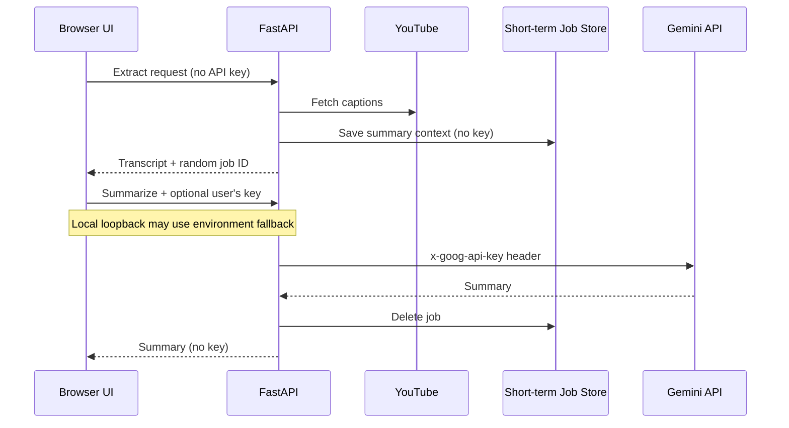

# Architecture

This document describes the browser application's implementation and trust boundaries. The `/api/*` routes are internal UI endpoints, not a versioned public API.

## Goals

- Extract captions without requiring a Gemini credential.
- Let hosted users supply their own Gemini API key only when needed.
- Allow a local loopback session to use the owner's environment key without exposing it to the browser.
- Never place an API key in a URL, response body, or short-term job record.
- Keep the extraction and summary flows consistent between local and hosted modes while limiting browser-profile access and environment-based Gemini fallback to local mode.

## Request flow

The two requests deliberately separate caption extraction from credential handling:

1. `POST /api/extract` accepts the video and transcript options. Its strict request schema rejects extra fields, including an accidentally supplied API key.
2. When a summary is requested, the server stores a minimal copy of the extracted summary context and returns a cryptographically random job ID.
3. `POST /api/summarize` receives that ID and, normally, the user's key in `X-Gemini-Api-Key`. A local loopback request may omit the header when the server process has a fallback key.
4. The Gemini client forwards the effective key to Google in `X-Goog-Api-Key`, never in the request URL.
5. A completed or skipped job is deleted immediately. A failed summary remains retryable until its refreshed TTL expires.

## Components

| Component | Responsibility |
|---|---|
| Browser UI | Collect options and an optional user key, call same-origin endpoints, preview and download results |
| FastAPI application | Validate requests, fetch captions, coordinate summaries, and enforce Web security boundaries |
| YouTube client | Read metadata and the selected original-language caption track |
| Short-term Job Store | Hold bounded summary context between extraction and summarization |
| Gemini client | List models and call `generateContent` with the effective key selected by the Web boundary |

## Internal HTTP surface

| Method | Path | Purpose | Gemini key |
|---|---|---|---|
| `GET` | `/` | Browser UI | None |
| `GET` | `/healthz` | Process health | None |
| `GET` | `/api/info` | Version, language choices, limits, and capabilities | None |
| `POST` | `/api/extract` | Fetch and format captions; optionally create a summary job | Rejected from the body |
| `POST` | `/api/summarize` | Summarize, retry, or skip a pending job | User header, or local loopback fallback; none for skip |
| `POST` | `/api/gemini/models` | List models available to the effective key | User header, or local loopback fallback |
| `POST` | `/api/summary/discard` | Delete an unused pending job | None |

All `/api/*` responses use `Cache-Control: no-store`. Validation errors report field locations and messages without reflecting submitted values.

## Short-term Job Store

The in-memory store accepts extracted results, not credentials. Before storage it removes the video description, chapters, and caption download-format details that are not needed for summarization.

Defaults:

- Lifetime: 600 seconds
- Maximum pending jobs: 64
- Maximum total pending caption characters: 5,000,000
- Maximum concurrent blocking extraction or Gemini operations: 4

Jobs are protected from simultaneous summary attempts. Expired idle jobs are purged, and completed or explicitly discarded jobs are removed immediately.

Because the store is process-local, the current hosted deployment must use one application worker. See [Hosted deployment](deployment.md) for scaling constraints.

## Local and hosted modes

Local mode binds to loopback by default and can ask `yt-dlp` to read a supported browser profile on the same computer. It may read `GEMINI_API_KEY` and `GEMINI_MODEL` once at startup. The API key fallback is accepted only for requests whose network peer is loopback, and only a Boolean availability flag is sent to the UI. An explicitly supplied `X-Gemini-Api-Key` header takes precedence.

Hosted mode binds externally by default and hides and rejects browser-cookie options because a remote server cannot access a visitor's profile. It always ignores the Gemini environment variables and uses the bring-your-own-key summary flow.
